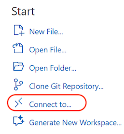
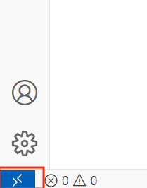

# Using dev Container in VSCode

## Introduction to Container in VSCode
The following guide is created to use docker container in VSCode. This is created because Anaconda has stopped building conda packages for Intel Macs. An alternative is to run docker container as the development platform.

This feature also expose VSCode capabilities on development on remote system and containers. We do not use the official microsoft dev containers. The setup of Microsoft dev-container is easier and it include a persistent volume for storage. However, it is difficult to access the volume without docker software. So one of our objective is to create a docker environment that uses local Mac folder as the data source and attached to the docker environment. We also use Ubuntu instead of Debian so as to create similar environment as Windows WSL users. 

## Docker Features
- Docker OS: Ubuntu (version: 24.04)
- Software: miniconda for Linux
- A default user `devuser` was created during the build.
- We do not use the official miniconda docker image as we are trying to create an image similar to WSL for windows user. 
- The folder `dev` can be placed in any place user desired.
- The docker file and the shell scripts are created to connect the docker container with the folder dev.
- Folder mapping (local): you can place the folder `dev` into any place such as `Downloads` or `Documents`.
- Folder mapping (container): in the container, `dev` is mapped to `/home/devuser/workspace`


## Hardware
- This has been tested on Intel Macs from 2019 onwards.


## Software Requirements
- VSCode installed
- Docker for Mac installed

## Folder Structure - `dev`
The main folder is `dev`, listed below is the folder structure
```css
.
├── .devcontainer
    ├── devcontainer.json
    ├── Dockerfile
    ├── docker_build.sh    
    └── docker_run.sh
└── # You can place any development project or git repository in this folder.   
```

All the docker related files and the shell scripts are contained in the folder `.devcontainer`


## Installation Steps

1. Run your docker app.

2. Open a terminal and navigate to this folder `vscode-dev-container`

3. Copy the folder `dev` to your local drive e.g. `cp -R dev/ /Users/your_path/dev`

```bash
cp -R source_folder destination_folder

# Example
cp -R dev/ ~/Downloads/dev
```

Note: you can also use `Finder` to perform this action.

4. Change the permission of the shell script to execution mode.

```bash
chmod +x docker_build.sh
chmod +x docker_run.sh
```

5. Check the shell script and change the mount drive to your local path. I use `/Users/aiml/Documents/dev` and mount to `/home/devuser/workspace`. You need to change to your local path. There are 2 files to be change:
- `docker_run.sh`
- `devcontainer.json`

6. Run `docker_build.sh` to build a docker image. You need to do it once. However, you need to rebuild whenever you made changes to `Dockerfile` or `devcontainer.json`. You need to be in the folder `.devcontainer` to run the build script.

```bash
./docker_build.sh
```

7. Run `docker_run.sh` to run the container whenever it is stopped. You need to rerun the script if you made changes to the file `docker_run.sh`. **DO NOT RUN** this script if you have run it previously. You can run this command in the `dev` folder.

```bash
./.devcontainer/docker_run.sh
```

8. To re-run a stopped container, you can hit the `play icon` :arrow_forward: either in the docker software or in the docker extension in VSCode. You can also use the following commands to run and stop a container:

```bash
# Start a stopped container
docker start ubuntu_miniconda
```

```bash
# Stop a running container
docker stop ubuntu_miniconda
```

```bash
# Restart a running container
docker restart ubuntu_miniconda
```

To connect to a running container outside VSCode use the following command:

```bash
docker exec -it -u devuser ubuntu_miniconda /bin/bash
```

9. In VSCode, we need to attached the running container to VSCode. Clicked in the `Connect to...` in the `Welcome page` (see image below). Alternatively, you can also click on the blue icon on the lower left corner (see image below). Click on `Attached to Running Container...` and select the running container. A new VSCode window will be launched with connection to the container. 





10. If there is any error opening the folder `/home/devuser/workspace`, you can direct VSCode to the correct folder.

11. Volume mapping: If you place `dev` inside Documents. The local mapping will be local:`~/Documents/dev/`. The mapping in the container will be `/home/devuser/workspace`. Any files added in the dev folder will be shown in `~/Documents/dev/` in Finder and `/home/devuser/workspace` in the Ubuntu environment.

12. There is a problem where if you open a new terminal in VSCode, it will default to `/bin/sh` instead of `bash`. We need `bash` to see our conda environment. Type `bash` every time you open a new terminal in VSCode.

13. To avoid typing `bash` every time we start a new terminal, we can make some chanegs to VSCode settings. Under `.vscode/settings.json` please add the following json key:

```json
"terminal.integrated.defaultProfile.linux": "bash"
```

14. You can also change the above using the command `CMD+Shift+P` and search for `Terminal: Configure Terminal Settings` and under `Terminal > Integrated > Env:Linux` and add the above setting.

15. You may need to reinstall Python, Jupyter extensions to the container environment.

> Final Note: You can also change the image name, container name the default user of the container. However, please make all the same changes across all files.

Reference:

https://code.visualstudio.com/docs/devcontainers/containers
